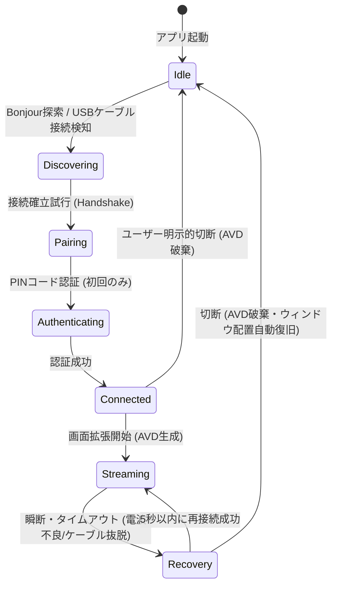

# ARCHITECTURE: 内部設計・データフロー定義書

## 1. 全体スレッド＆キュー設計
低遅延処理を保証するため、ホスト（macOS）およびクライアント（iPadOS）はスレッドを厳格に分離し、メインスレッドのブロッキングを回避する非同期アーキテクチャを採用します。

### 1.1 macOS (Host) スレッド構成
```
[Main Thread] (UI/ウィンドウ管理/ユーザー入力)
   │
   ├── [AVD Event Queue] (VirtualDisplayの起動・ライフサイクル管理)
   │
   ├── [SCK Capture Queue] (ScreenCaptureKitのフレーム受信用: Serial Dispatch Queue)
   │     └── キャプチャコールバック (CVPixelBufferの取得)
   │           │
   │           ▼
   ├── [VideoToolbox Queue] (エンコード処理スレッド)
   │     └── H.264/HEVC リアルタイム圧縮 (B-Frames = 0)
   │           │
   │           ▼
   └── [Socket Send Queue] (送信用バックグラウンドスレッド)
         └── USBMuxd / Bonjour TCPソケットへのノンブロッキング送信 (TCP_NODELAY)
```

---

## 2. 接続状態遷移 (State Machine)

MacとiPadの間のピアツーピア接続のライフサイクルは、以下のステートマシンに従って制御されます。



---

## 3. 通信データパケット仕様 (Packet Protocol)

Wi-FiおよびUSB/Thunderbolt経由でのTCPソケット通信において、画面データと入力データを効率的かつ低オーバーヘッドで識別するためのカスタムバイナリプロトコルを定義します。

### 3.1 パケット共通ヘッダー (Packet Header: 12 bytes)
すべてのパケットは、先頭に以下の12バイトの共通ヘッダーを持ちます。

| バイト位置 (Offset) | データ型 (Type) | フィールド名 (Field Name) | 説明 (Description) |
| :--- | :--- | :--- | :--- |
| `0x00 - 0x03` | `uint32_t` | `magicNumber` | プロトコル識別マジックナンバー (`0x58445350` = "XDSP") |
| `0x04 - 0x05` | `uint16_t` | `packetType` | パケットタイプ (下記参照) |
| `0x06 - 0x07` | `uint16_t` | `reserved` | 予約領域 (将来の拡張用: `0x0000`) |
| `0x08 - 0x0B` | `uint32_t` | `payloadLength` | ペイロードデータサイズ (ヘッダーを除いた実データ長) |

### 3.2 パケットタイプ定義 (`packetType`)
- `0x0001`: **Ping / Pong** (接続確認・遅延測定用)
- `0x0002`: **Handshake Request / Response** (初期情報、解像度、OSバージョン情報の交換)
- `0x0003`: **Auth / PIN Verify** (ペアリング認証)
- `0x0010`: **Video Stream Frame** (H.264/HEVC エンコードされたNALユニットのペイロード)
- `0x0020`: **Touch Input Event** (iPad側からのシングル/マルチタッチ座標データ)
- `0x0021`: **Apple Pencil Event** (タッチ座標に加え、筆圧・傾き・消しゴム情報を含む高精度ペンデータ)
- `0x0030`: **Command / Control** (解像度の動的変更、画面スリープ、切断通知など)

### 3.3 ペイロード構成例

#### ① Video Stream Frame (`0x0010`)
ヘッダーの直後に以下のメタデータが入り、その後にH.264/H.265のNALユニットバイナリが続きます。
- `frameNumber` (`uint32_t`: 4 bytes): 連番フレームインデックス
- `timestamp` (`uint64_t`: 8 bytes): 送信側タイムスタンプ (遅延計測用)
- `videoData` (`Variable bytes`): H.264/HEVC NAL Units (SPS/PPS, I-Frame, P-Frame)

#### ② Apple Pencil Event (`0x0021`)
iPadから逆送信される高精度ペン入力パケットのペイロード構造です。
- `x` (`float`: 4 bytes): 横方向正規化座標 (0.0 〜 1.0)
- `y` (`float`: 4 bytes): 縦方向正規化座標 (0.0 〜 1.0)
- `pressure` (`float`: 4 bytes): 筆圧値 (0.0 〜 1.0)
- `tilt` (`float`: 4 bytes): ペンの傾き角度 (ラジアン)
- `azimuth` (`float`: 4 bytes): ペンの平面的向き (ラジアン)
- `eventType` (`uint8_t`: 1 byte): `0` = TouchBegan, `1` = TouchMoved, `2` = TouchEnded
