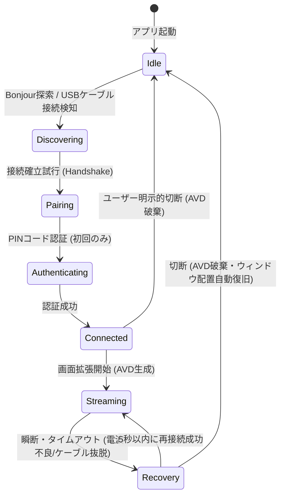

# ARCHITECTURE: 内部設計・データフロー定義書

## 1. 全体スレッド＆キュー設計
低遅延処理を保証するため、ホスト（macOS）およびクライアント（iPadOS / macOS Client）はスレッドを厳格に分離し、メインスレッドのブロッキングを回避する非同期アーキテクチャを採用します。

### 1.1 macOS (Dual-Mode: Host + Client) スレッド構成
macOSアプリはホスト（送信）とクライアント（受信）の両機能を持ったマルチスレッドとして動作可能です。

```
[Main Thread] (UI/ウィンドウ管理/ユーザー入力/ライフサイクル)
   │
   ├── 【Host / 送信側コンポーネント】
   │     ├── [AVD Event Queue] (CGVirtualDisplayの起動・ライフサイクル管理)
   │     ├── [SCK Capture Queue] (ScreenCaptureKitのフレーム受信用: Serial Dispatch Queue)
   │     │     └── キャプチャコールバック (CVPixelBufferの取得)
   │     ├── [VideoToolbox Queue] (エンコード処理スレッド: H.264/HEVC 圧縮)
   │     └── [Socket Send Queue] (USBMuxd / Bonjour TCPソケットへのノンブロッキング送信)
   │
   └── 【Client / 受信側コンポーネント】
         ├── [Socket Recv Queue] (TCPソケット受信スレッド)
         ├── [VideoToolbox Dec Queue] (ハードウェアデコード処理スレッド)
         └── [Metal Render Queue] (MTKViewを用いた画面描画スレッド: 60fps)
```

---

## 2. 接続状態遷移 (State Machine)

MacとiPadの間のピアツーピア接続のライフサイクルは、以下のステートマシンに従って制御されます。



---

## 2.1 追加ステート

- Degraded
  - フレーム落ち、thermal、帯域不足、encoder遅延時
  - bitrate / fps / resolution を下げて継続

- Reconfiguring
  - 解像度変更、iPad回転、仮想ディスプレイ再生成中
  - 入力と描画を一時停止し、成功後Streamingへ戻る

- Fatal
  - 権限拒否、Private API不在、連続復旧失敗
  - 自動復旧せず、ユーザーに原因と対処を表示


## 3. 通信データパケット仕様 (Packet Protocol)

低遅延・超軽量通信を実現するため、プロトコルは極めてシンプルなヘッダー構造を採用しています。

### 3.1 パケット構造

```
[ 4 bytes: Payload Length (UInt32, Big-Endian) ] [ Variable bytes: Payload ]
```

### 3.2 ペイロード構造 (Payload)

ペイロードの先頭1バイトはデータ型を識別するマジックバイト（`XDisplayPayloadMagic`）です。

```
[ 1 byte: Magic ] [ Variable bytes: Encrypted or Plain Body ]
```

#### マジックバイト一覧 (`XDisplayPayloadMagic`)
- `0x02` (Pairing Request): ペアリング要求 (Salt + UUID)
- `0x03` (Pairing Verify): ペアリング検証 (UUID + Token Auth Flag + Encrypted Token)
- `0x04` (Pairing Result): ペアリング結果 (Success Flag + Encrypted Token)
- `0x10` (Video Frame): ビデオストリームフレーム (Encrypted H.264/HEVC NAL Units)
- `0x11` (Input Event): 入力イベント (Encrypted Touch/Pencil イベント)
- `0x12` (Client Info): クライアント環境情報 (Encrypted orientation/codec/fps)
