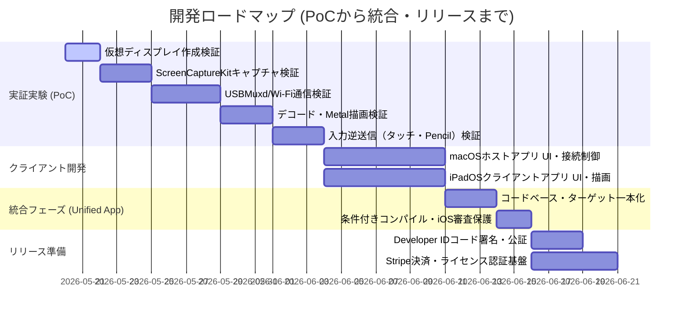

# PLAN: macOS-iPad 画面拡張アプリケーション 開発計画書

## 1. プロジェクト目標
macOSの画面をiPadにセカンドディスプレイ（拡張画面）として拡張する、超低遅延（1フレーム以下・約16ms遅延）の商用アプリケーションを開発する。

## 2. マイルストーン

---

## 3. 技術的設計アプローチ（コア仕様）

### ① 仮想ディスプレイ制御（macOS）
- **CoreGraphics Private API** (`CGVirtualDisplay` 等) を `NSClassFromString` により動的ロード。
- `CGVirtualDisplayDescriptor`, `CGVirtualDisplaySettings`, `CGVirtualDisplayMode` を用いて、システム設定に 1920x1080 (HiDPI) などの画面を即座に追加する。

### ② ビデオ伝送パイプライン（ゼロレイテンシ）
- **キャプチャ**: `ScreenCaptureKit` によるゼロコピーVRAMキャプチャ。
- **エンコード**: `VideoToolbox` (H.264/HEVC) で `RealTime = true` および **Bフレーム無効化（MaxFrameDelayCount = 0）** による遅延の完全排除。
- **転送**: Wi-Fi (Bonjour/TCP) および USB/Thunderbolt (USBMuxd/TCP)。ソケットに `TCP_NODELAY = true` を設定し、送信遅延を極小化。
- **デコード・描画**: iPad側 `VideoToolbox` でハードウェアデコードし、生成されたピクセルバッファを直接 `Metal` (MTKView) にバインドして超低遅延描画。

### ③ 機能スコープ
- **初期フェーズ**: 画面拡張および入力制御（タッチ、Apple Pencil対応）のみ。
- **音声転送**: 実装の複雑化と遅延を避けるため、初期フェーズでは「非対応」とする。

---

## 4. 配布・ライセンス設計
- **アプリの一本化**: 送信（Host）と受信（Client）のロジックを単一のコードベースに一本化。
  - **macOS用**: 送信（Host）および受信（Client：別Macからの拡張画面化）の両方をサポート。
  - **iOS/iPadOS用**: 受信（Client）のみをサポート。
- **配布戦略 (ハイブリッド)**:
  - **iPadOSクライアント**: App Storeにて公式配布（受信機能のみのため、Private APIをビルドから完全に除外して審査を通過）。
  - **macOSアプリ**: Mac App Store非対応（`CGVirtualDisplay` のPrivate API利用のため）。独自Webサイトから直販し、Developer IDでコード署名およびAppleの公証（Notarization）を行う。
- **アップデート通知**: macOSアプリに `Sparkle.framework` を組み込み、自動アップデート導線を確保する。

