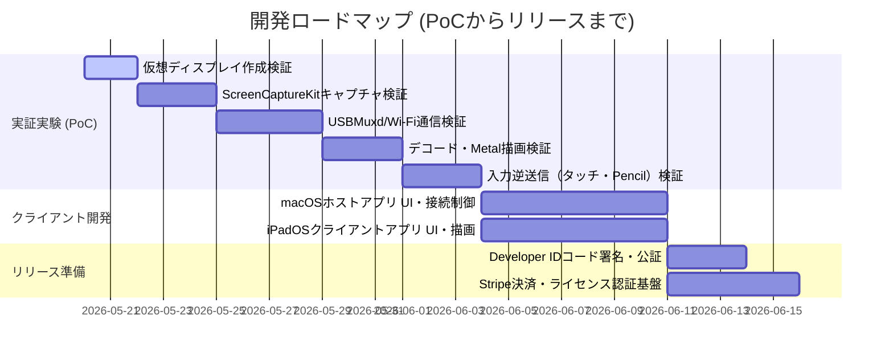

# PLAN: macOS-iPad 画面拡張アプリケーション 開発計画書

## 1. プロジェクト目標
macOSの画面をiPadにセカンドディスプレイ（拡張画面）として拡張する、超低遅延（1フレーム以下・約16ms遅延）の商用アプリケーションを開発する。

## 2. マイルストーン

---

## 3. 技術的設計アプローチ（コア仕様）

### ① 仮想ディスプレイ制御（macOS）
- `AppleVirtualDisplay.framework` (Private API) を `dlopen` による動的ロード。
- `AVDVirtualDisplayController` と `AVDVirtualDisplay` を用いて、システム設定に 1920x1080 (HiDPI) などの画面を即座に追加する。

### ② ビデオ伝送パイプライン（ゼロレイテンシ）
- **キャプチャ**: `ScreenCaptureKit` によるゼロコピーVRAMキャプチャ。
- **エンコード**: `VideoToolbox` (H.264/HEVC) で `RealTime = true` および **Bフレーム無効化（MaxFrameDelayCount = 0）** による遅延の完全排除。
- **転送**: Wi-Fi (Bonjour/TCP) および USB/Thunderbolt (USBMuxd/TCP)。ソケットに `TCP_NODELAY = true` を設定し、送信遅延を極小化。
- **デコード・描画**: iPad側 `VideoToolbox` でハードウェアデコードし、生成されたピクセルバッファを直接 `Metal` (MTKView) にバインドして超低遅延描画。

### ③ 機能スコープ
- **初期フェーズ**: 画面拡張および入力制御（タッチ、Apple Pencil対応）のみ。
- **音声転送**: 実装の複雑化と遅延を避けるため、初期フェーズでは「非対応」とする。

---

## 4. 配布・ライセンス設計
- **macOSホスト**: Mac App Store非対応のため、独自Webサイトからの直販。Developer IDでコード署名およびAppleの公証（Notarization）を必須とする。
- **iPadOSクライアント**: App Storeにて公式配布。
- **アップデート通知**: macOSホストアプリに `Sparkle.framework` を組み込み、OSアップデート等の追従に伴う強制/推奨アップデート導線を確保する。
